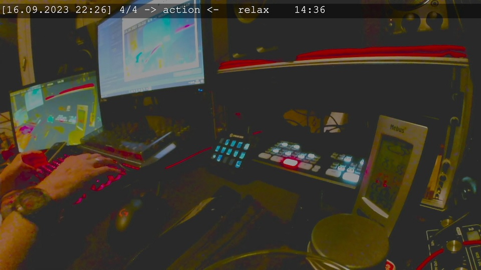

# pomodoro-logger

## Write a "pomodoro timer" into a text file
CLI tool to write Pomodoro timer to a log file for OBS integration (Text GDI+)<br>


```
# more pomodoro.log
[16.09.2023 21:05] start 4 pomodoro rounds (20m 5m)
...
[16.09.2023 22:31] 4/4    action      relax    08:53
[16.09.2023 22:31] 4/4 -> action <-   relax    08:52
[16.09.2023 22:31] 4/4    action      relax    08:51
[16.09.2023 22:31] 4/4 -> action <-   relax    08:50
...
```

## Use pomodoro log file with OBS Studio
The Pomodoro log file can be used with OBS Studio (Open Broadcaster Software) as a Pomodoro timer <br>



The text file "pomodoro.log" is generated by using the python logging mechanism. <br>
Attention: The log file will grow (one entry per second) while the script is running.<br>

## Start pomodoro timer
a) download the Python script<br>
b) run the python script:<br>
```
# python pomodoro-logger.py
```

the script will automatically start writing the timer data line by line<br> 
to the file "pomodoro.log" in the same directory as the script:

c) stop python script with "\<ctrl\> c" <br>

You can use this log file for OBS, as a working time log or to evaluate your "action times".

## Change Pomodoro settings
You can change the number of rounds, the "action time" (minutes) and the "rest time" (minutes) 
by changing the following constants in the main() part of the Python script:
```sh
pomorounds = 4          # set number of pomodoro rounds ..
pomoactiontime = 30     # set minutes to focus
pomorelaxtime = 5       # set minutes for break time
```

## OBS Configuration
Run the script for a few seconds to generate the log file for the first time.<br>
Launch OBS and select your scene to add the Pomodoro counter.<br>
a) add "Text(GDI+)" to a "OBS Szene"<br>
b) activate "Aus Datei lesen" (read from file)<br>
c) select the "pomodoro.log" file from your Python script location <br>


## OBS Fine Tuning (OBS Configuration Options)
```
Schriftart: "Courier New Standard" (Size 70)
Aus Datei lesen (aktiv)
Antialiasing aktivieren (aktiv)
Farbe: "#ffffff"
Deckkraft "90%"
Hintergrundfarbe "#000000"
Hintergrunddeckkraft "70%"
Ausrichtung "Zentriert"
Vertikale Ausrichtung "Zentriert"
Kontur (aktiv)
Konturgröße "2"
Konturfarbe "#a5a5a5"
Konturdeckkraft "100%"
Chatlogmodus (aktiv)
Chatlogzeilenlimit "1"
Benutzerdefinierten Textbereich benutzen (aktiv)
Breite "3000"
Höhe "90"
Zeilenumbruch (DEAKTIV)
```
